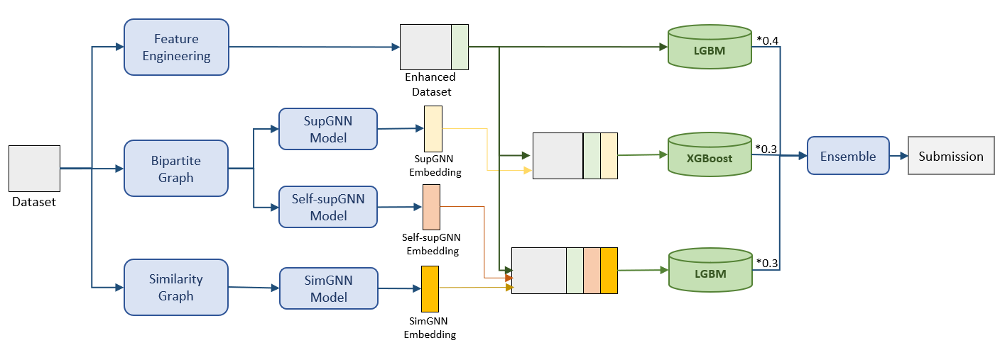
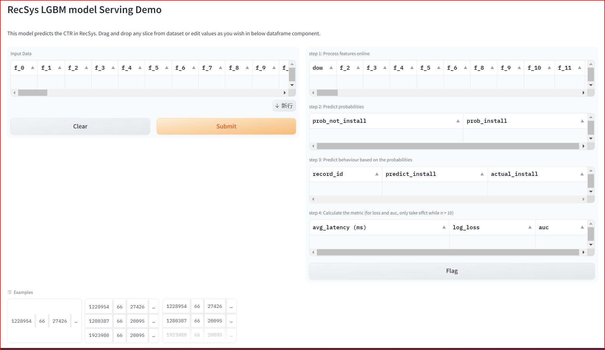

# Application Installation Prediction

## Problem Description
A problem which focus on online advertising. The dataset corresponds to impressions of users and ads from ShareChat + Moj app, where each impression (a set of 80 features) is an advertisement (ad) that was shown to a user and whether that resulted in a click or an install of the application corresponding to the advertisement. The problem is to predict the probability of an impression resulting in application installation.

## Solution Overview
The solution leverages a novel feature classification method to categorize anonymous features into different groups and apply enhanced feature engineering and graph neural networks to reveal underlying information and improve prediction accuracy. This solution can also be generalized to other privacy preserving recommendation systems.


## Getting Started

### Step 1: Prepare the dataset
- Download the RecSys Challenge 2023 dataset from the official [website](https://sharechat.com/recsys2023/login)

### Step 2: Prepare the environment
```bash
export WORKDIR=`pwd`
export USECASE_PATH=${WORKDIR}"/usecases/1_app_installation_pred/"
mkdir -p ${USECASE_PATH}/dataset; cd dataset; unzip sharechat.zip
```

### Step 3: Training the model
- Trigger training using the following command
```bash
cd ${WORKDIR}/recsys_kit/models/lightgbm/docker
docker-compose up classic-ml-train
```

### Step 4: Update trained model to model repository 
- Renamed the trained model into `model.txt`, and move it to the triton models server
```bash
cp ${USECASE_PATH}/output/models/lgbm_trained_HPO1.mdl ${USECASE_PATH}/model_store/prediction/1/model.txt
```

## Step 5: launch serving
- Start Triton Inference Server
```bash
cd ${WORKDIR}/recsys-kits/serve/triton_serve/docker
docker-compose up triton-server-cpu
```

<!-- ## Step 5: start the Gradio server to build the user interface
```bash
cd docker
docker-compose restart classic-ml-infer-client
```

## Step 6: open your browser and send the request
- visit at http://yourip:7861
- you will see the UI in the below figure
<p align="center">
  
</p> -->
