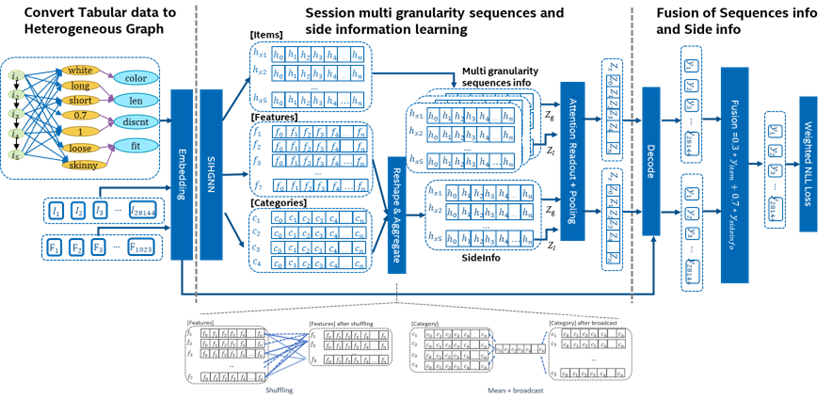
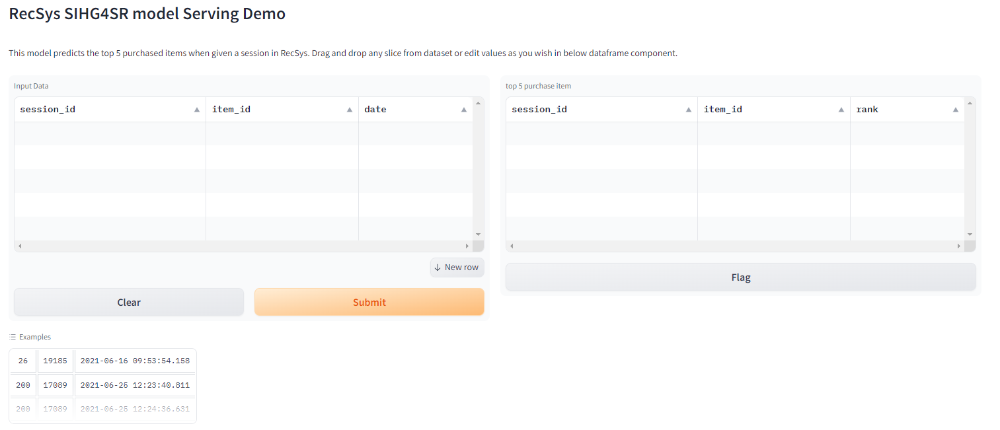

# Shopping Cart Purchase Item Prediction

## Problem Description
A problem focuses on fashion recommendations. When given user sessions, purchase data and content data about items, can you accurately predict which fashion item will be bought at the end of the session. To better predict, this problem will provide content such as anonymous descriptive labels of the items (such as color, length, neckline, sleeve style, etc.).

## Solution Overview
Our solution uses a graph neural network (GNN) to learn from each session to reveal the underlying connection between viewed items and the final purchased item, the model is developed based on an open-source model and improved by Intel by adding novel ideas including aggregation the item and side information, fusing different predictions, and enhancing accuracy with a weighted loss function. The enhanced model is called 'SIHG4SR'.


## Getting Started

## Step 1: Prepare the dataset
- Download the RecSys Challenge 2022 dataset from the official [website](https://dressipi.com/downloads/recsys-datasets/)
- Put the dataset to your `data_path`

### Step 2: Prepare the environment
```bash
export WORKDIR=`pwd`
export USECASE_PATH=${WORKDIR}"/usecases/2_shopping_cart_purchase_item_pred/"
mkdir -p ${USECASE_PATH}/dataset; cd dataset; unzip dressipi_recsys2022_datasets.zip
```

### Step 3: Training the model
- Using docker
```bash
cd ${WORKDIR}/recsys_kit/models/sihg4sr/docker
docker-compose up sihg4sr-train
```

### Step 4: start the Torchserve inference server
- Using docker
```bash
cd ${WORKDIR}/recsys_kit/models/triton_serve/docker
docker-compose up triton-server-cpu
```

### Step 5: open your browser and send the request
- visit at http://yourip:7861
- you will see the UI in the below figure
<p align="center">
  
</p>

## Customization with SDK
```bash
conda create -n sihg4sr python=3.11
conda activate sihg4sr
cd ${WORKDIR}; pip install .
cd ${WORKDIR}/recsys-kits/models/sihg4sr; pip install .
cd ${USECASE_PATH}; ./script/run_train.sh
cd ${USECASE_PATH}; ./script/run_serve.sh
```